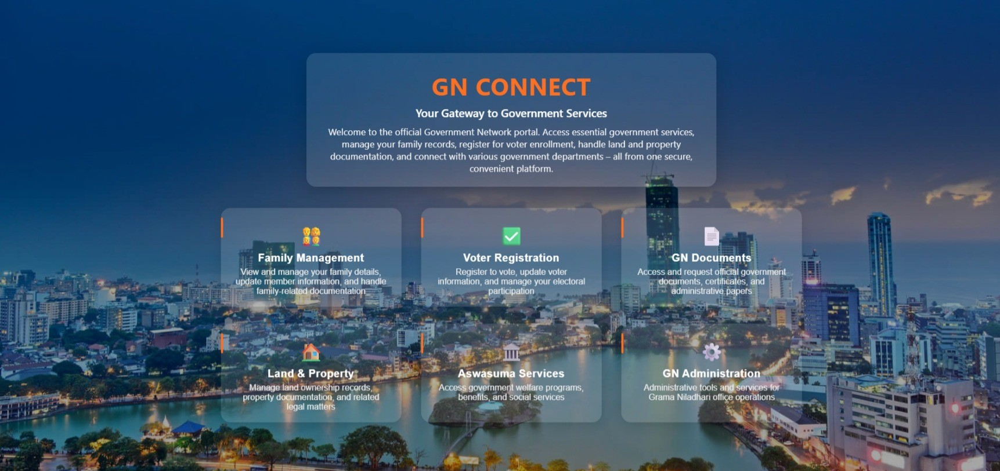
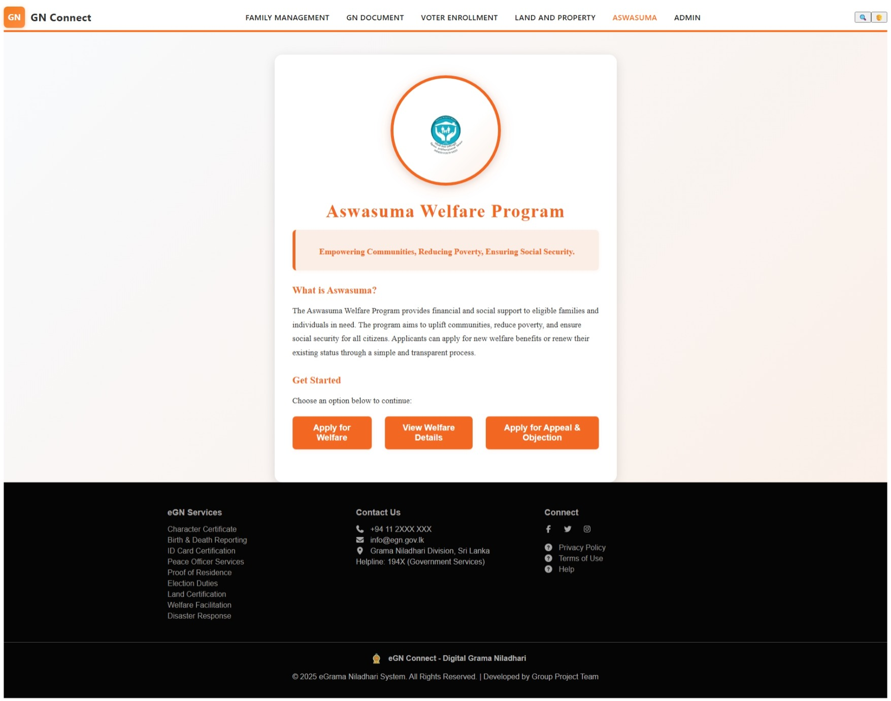
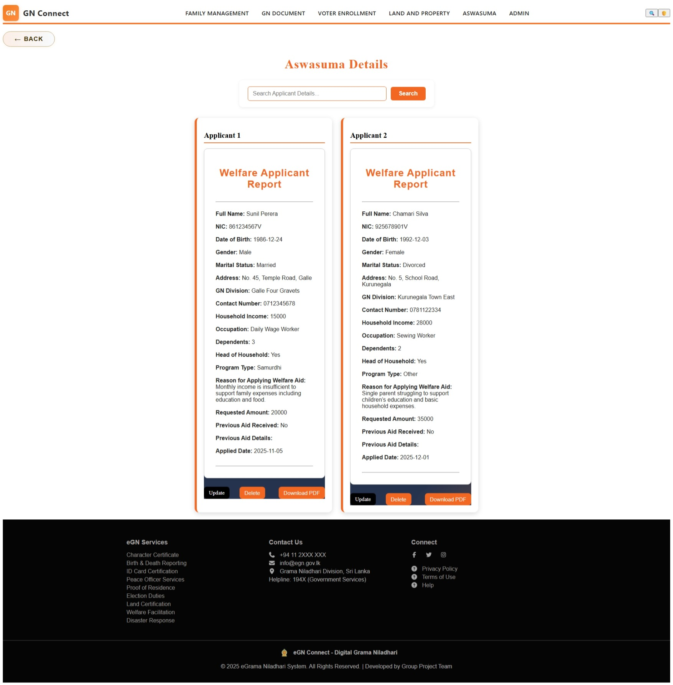
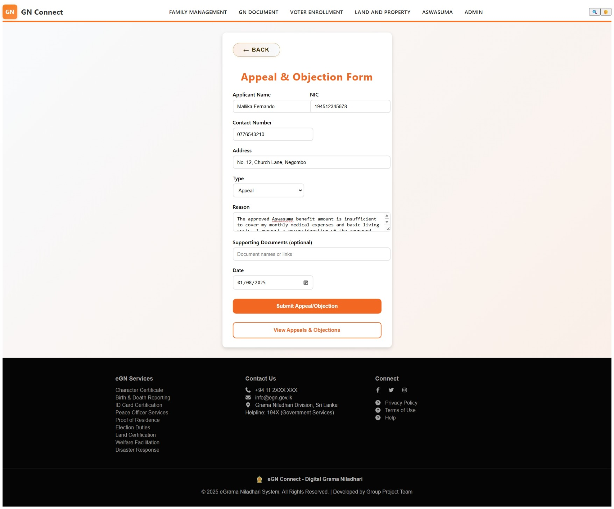
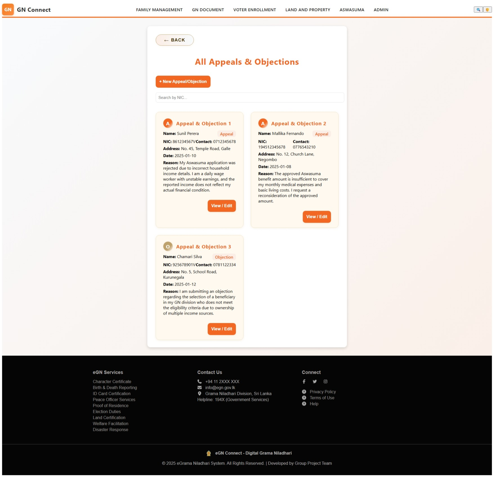
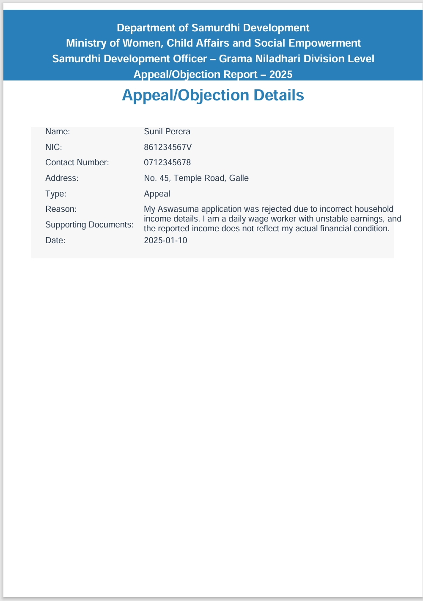

# GN Connect – Digital Grama Niladari System

The Digital Grama Niladhari System is a web-based application developed using the MEAN Stack (MongoDB, Express.js, React, Node.js) to digitalize and simplify the operations carried out by the Grama Niladhari officers in Sri Lanka. The system provides a centralized platform that connects citizens and officers, improving communication, data management, and service efficiency within the Grama Niladhari division.

The platform is divided into multiple modules to handle various administrative tasks. These include Voter Registration, Aswasuma Management, Family Management, Document Requirement Management, and Land and Property Management. Each module focuses on maintaining and organizing data specific to its purpose, ensuring secure, accurate, and efficient record-keeping.

From the citizen’s perspective, the system allows users to register, log in, and manage their personal information. Citizens can view their profile details, request official documents, check Aswasuma eligibility, and update voter information directly through the system. This user-friendly interface ensures easy access to essential government services without the need for in-person visits.

For the admin (Grama Niladhari officer), the system provides a comprehensive dashboard displaying key statistics and notifications related to registered users, pending document requests, property details, and ongoing applications. Admins can manage user records, verify requests, generate reports, and monitor each module efficiently through the centralized control panel.

Overall, the Digital Grama Niladhari System aims to enhance transparency, accessibility, and data-driven decision-making within the local government administration. By adopting modern web technologies, the system reduces manual paperwork, minimizes human error, and promotes digital governance across communities.

## Languages and Tools:

<a href="https://code.visualstudio.com/" target="_blank" rel="noreferrer"> &nbsp;
 </a>
&nbsp;&nbsp;
  </a>

## Team Members:

Our project was developed collaboratively by five team members, each responsible for a specific module of the system:
1. Aswasuma Management – Manuthi
2. Family Management – Ishoda
3. Document Requirement Management – Sadasi
4. Voter Registration – Udara
5. Land and Property Management – Sudesh

## Setup and Run Instructions:

- Clone the repository : git clone https://github.com/Manuthi24/GN-Connect
- Navigate to the project directory : cd gn-connect
- Backend Setup:  
  Navigate to backend folder: cd backend  
  Install dependencies: npm install  
  Start the backend server: npm start  
- Frontend Setup:  
  Navigate to frontend folder: cd ../frontend  
  Install dependencies: npm install  
  Start the React app: npm start  
- Access the application : Open a web browser and go to: http://localhost:3000  
  
## Future Enhancements:

Planned enhancements for the system include a mobile application version for greater accessibility, email and SMS notifications for updates, AI-based form validation and document scanning, and multi-language support including Sinhala, Tamil, and English to cater to all citizens.

## 📸 Screenshots / UI Preview

  
  
  

  
  
  

  

## 🤝 Ask Anything

  
  &nbsp;&nbsp;
  
  &nbsp;&nbsp;
  

